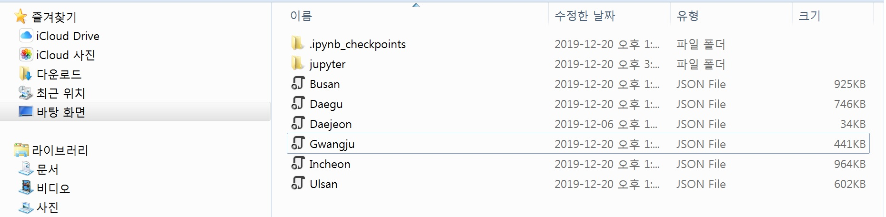

# southkorea_metropolitan_geojson

개인적인 파이썬 프로젝트를 진행하면서, 서울과 전국단위로만 제공되고 있는 geojson 자료에 한계를 느꼈습니다.
그래서 Github에 올라와있는 southkorea-maps(https://github.com/southkorea/southkorea-maps)의 kostat 자료를 참고해 광역시 단위의
geojson 자료를 만들었습니다. 처음이라 엉성한 자료이긴 하지만, 사용하실 분은 파이썬 folium 활용시나 다른 경우에 유용하게 사용해주셨음 좋겠습니다!

# requirements

  pip install json 
  pip install folium 
  
   json 과 folium의 설치가 필요합니다.
  
  
# How to use

folium 사용 방법 위주로 설명 드리겠습니다. folium의 자세한 설명은
https://python-visualization.github.io/folium/quickstart.html 을 참고해 주세요.

1. github의 전국 geojson 자료를 다운받아 주세요. (manual_1 사진 참고)

2. jupyter 파일인 geojson_test_jupyter 를 실행해주세요. 
들어가있는 geojson의 이름만 Busan, Daejeon 등으로 바꾸어서 사용하면 됩니다. (manual_2 사진 참고)

# example

저의 경우엔 대전의 json 자료를 이용해 다음과 같이 등치지역도를 그리는데 활용해 보았습니다.

